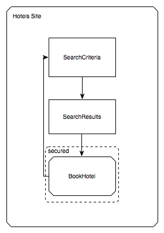

== Defining Flows

This chapter begins the Users Section.
It shows how to implement flows by using the flow definition language.
By the end of this chapter, you should have a good understanding of language constructs and be capable of authoring a flow definition.

[[_flow_overview]]
== What Is a Flow?

A flow encapsulates a reusable sequence of steps that you can use in different contexts.
The following a http://www.jjg.net/ia/visvocab/[Garrett Information Architecture] diagram shows a reference to a flow that encapsulates the steps of a hotel booking process:

[[_flow_makeup]]
== What Is the Makeup of a Typical Flow?

In Spring Web Flow, a flow consists of a series of steps called "`states`".
Entering a state typically results in a view being displayed to the user.
On that view, user events occur and are handled by the state.
These events can trigger transitions to other states that result in view navigations.

The following image shows the structure of the book hotel flow referenced in the previous diagram:

image::images/hotels-site-bookhotel-flow.png[]

[[_flow_authoring]]
== How Are Flows Authored?

Flows are authored by web application developers by using a simple XML-based flow definition language.
The next steps of this guide walk you through the elements of this language.

[[_essential_flow_elements]]
== Essential Language Elements

There are four essential flow elements:

* <<_flow_element>>
* <<_view_state_element>>
* <<_transition_element>>
* <<_end_state_element>>

[[_flow_element]]
=== The `flow` Element

Every flow begins with the following root element:

[source,xml]
----

<?xml version="1.0" encoding="UTF-8"?>
<flow xmlns="http://www.springframework.org/schema/webflow"
      xmlns:xsi="http://www.w3.org/2001/XMLSchema-instance"
      xsi:schemaLocation="http://www.springframework.org/schema/webflow
                          https://www.springframework.org/schema/webflow/spring-webflow.xsd">

</flow>
----

All states of the flow are defined within this element.
The first state defined becomes the flow's starting point.

[[_view_state_element]]
=== The `view-state` Element

Use the `view-state` element to define a step of the flow that renders a view:

[source,xml]
----

<view-state id="enterBookingDetails" />
----

By convention, a view-state maps its id to a view template in the directory where the flow is located.
For example, the state above might render [path]_/WEB-INF/hotels/booking/enterBookingDetails.xhtml_				if the flow itself was located in the [path]_/WEB-INF/hotels/booking_ directory.

[[_transition_element]]
=== The `transition` Element

Use the `transition` element to handle events that occur within a state:

[source,xml]
----

<view-state id="enterBookingDetails">
    <transition on="submit" to="reviewBooking" />
</view-state>
----

These transitions drive view navigations.

[[_end_state_element]]
=== The `end-state` Element

Use the `end-state` element to define a flow outcome:

[source,xml]
----

<end-state id="bookingCancelled" />
----

When a flow transitions to a end-state, it ends and the outcome is returned.

=== Checkpoint: Essential language elements

With the three elements, `view-state`, `transition`, and `end-state`, you can quickly express your view navigation logic.
Teams often do this before adding flow behaviors so that they can focus on developing the user interface of the application with end users first.
The following sample flow implements its view navigation logic by using these elements:

====
[source,xml]
----

<flow xmlns="http://www.springframework.org/schema/webflow"
      xmlns:xsi="http://www.w3.org/2001/XMLSchema-instance"
      xsi:schemaLocation="http://www.springframework.org/schema/webflow
                          https://www.springframework.org/schema/webflow/spring-webflow.xsd">

    <view-state id="enterBookingDetails">
        <transition on="submit" to="reviewBooking" />
    </view-state>

    <view-state id="reviewBooking">
        <transition on="confirm" to="bookingConfirmed" />
        <transition on="revise" to="enterBookingDetails" />
        <transition on="cancel" to="bookingCancelled" />
    </view-state>

    <end-state id="bookingConfirmed" />

    <end-state id="bookingCancelled" />

</flow>
----
====

[[_flow_actions]]
== Actions

Most flows need to express more than view navigation logic.
Typically, they also need to invoke business services of the application or other actions.

Within a flow, there are several points where you can execute actions:

* On flow start
* On state entry
* On view render
* On transition execution
* On state exit
* On flow end

Actions are defined by using a concise expression language.
Spring Web Flow uses the Unified EL by default.
The next few sections cover the essential language elements for defining actions.

[[_evaluate_element]]
=== The `evaluate` Element

The most-often-used action element is the `evaluate` element.
You can use the `evaluate` element to evaluate an expression at a point within your flow.
With this single element, you can invoke methods on Spring beans or any other flow variable.
The following listing shows an example:

====
[source,xml]
----

<evaluate expression="entityManager.persist(booking)" />
----
====

[[_evaluate_element_result]]
==== Assigning an `evaluate` Result

If the expression returns a value, that value can be saved in the flow's data model called `flowScope`, as follows:

====
[source,xml]
----
<evaluate expression="bookingService.findHotels(searchCriteria)" result="flowScope.hotels" />
----
====

[[_evaluate_element_result_type]]
==== Converting an `evaluate` Result

If the expression returns a value that may need to be converted, you can specify the desired type by using the `result-type` attribute, as follows:

====
[source,xml]
----

<evaluate expression="bookingService.findHotels(searchCriteria)" result="flowScope.hotels"
          result-type="dataModel"/>
----
====

[[_checkpoint_actions]]
=== Checkpoint: Flow Actions

You should review the sample booking flow with actions added:

====
[source,xml]
----
<flow xmlns="http://www.springframework.org/schema/webflow"
      xmlns:xsi="http://www.w3.org/2001/XMLSchema-instance"
      xsi:schemaLocation="http://www.springframework.org/schema/webflow
                          https://www.springframework.org/schema/webflow/spring-webflow.xsd">

    <input name="hotelId" />

    <on-start>
        <evaluate expression="bookingService.createBooking(hotelId, currentUser.name)"
                  result="flowScope.booking" />
    </on-start>

    <view-state id="enterBookingDetails">
        <transition on="submit" to="reviewBooking" />
    </view-state>

    <view-state id="reviewBooking">
        <transition on="confirm" to="bookingConfirmed" />
        <transition on="revise" to="enterBookingDetails" />
        <transition on="cancel" to="bookingCancelled" />
    </view-state>

    <end-state id="bookingConfirmed" />

    <end-state id="bookingCancelled" />

</flow>
----
====

This flow now creates a `Booking` object in flow scope when it starts.
The ID of the hotel to book is obtained from a flow input attribute.

[[_flow_inputoutput]]
== Input/Output Mapping

Each flow has a well-defined input/output contract.
Flows can be passed input attributes when they start and can return output attributes when they end.
In this respect, calling a flow is conceptually similar to calling a method with the following signature:

====
[source,java]
----
FlowOutcome flowId(Map<String, Object> inputAttributes);
----
====

Where a `FlowOutcome` has the following signature:

====
[source,java]
----
public interface FlowOutcome {
   public String getName();
   public Map<String, Object> getOutputAttributes();
}
----
====

[[_input_element]]
=== input

You can use the `input` element to declare a flow input attribute, as follows:

====
[source,xml]
----
<input name="hotelId" />
----
====

Input values are saved in flow scope under the name of the attribute.
For example, the input in the prececing example is saved under a name of `hotelId`.

[[_input_element_type]]
==== Declaring an Input Type

Use the `type` attribute to declare the input attribute's type:

====
[source,xml]
----
<input name="hotelId" type="long" />
----
====

If an input value does not match the declared type, a type conversion is attempted.

[[_input_element_value]]
==== Assigning an Input Value

You can use the `value` attribute to specify an expression to which to assign the input value, as follows:

====
[source,xml]
----
<input name="hotelId" value="flowScope.myParameterObject.hotelId" />
----
====

If the expression's value type can be determined, that metadata is used for type coercion if no `type` attribute is specified.

[[_input_element_required]]
==== Marking an input as required

You can use the `required` attribute to enforce the input is not null or empty, as follows:

====
[source,xml]
----
<input name="hotelId" type="long" value="flowScope.hotelId" required="true" />
----
====

[[_output_element]]
=== The `output` Element

You can use the `output` element to declare a flow output attribute.
Output attributes are declared within end-states that represent specific flow outcomes.
The following listing defines an `output` element:

====
[source,xml]
----
<end-state id="bookingConfirmed">
    <output name="bookingId" />
</end-state>
----
====

Output values are obtained from flow scope under the name of the attribute.
For example, the output in the preceding example would be assigned the value of the `bookingId` variable.

[[_output_element_value]]
==== Specifying the Source of an `output` Value

You can use the `value` attribute to denote a specific output value expression, as follows:

====
[source,xml]
----
<output name="confirmationNumber" value="booking.confirmationNumber" />
----
====

[[_checkpoint_input_output]]
=== Checkpoint: Input/Output Mapping

You should review the sample booking flow with input/output mapping:

====
[source,xml]
----
<flow xmlns="http://www.springframework.org/schema/webflow"
      xmlns:xsi="http://www.w3.org/2001/XMLSchema-instance"
      xsi:schemaLocation="http://www.springframework.org/schema/webflow
                          https://www.springframework.org/schema/webflow/spring-webflow.xsd">

    <input name="hotelId" />

    <on-start>
        <evaluate expression="bookingService.createBooking(hotelId, currentUser.name)"
                  result="flowScope.booking" />
    </on-start>

    <view-state id="enterBookingDetails">
        <transition on="submit" to="reviewBooking" />
    </view-state>

    <view-state id="reviewBooking">
        <transition on="confirm" to="bookingConfirmed" />
        <transition on="revise" to="enterBookingDetails" />
        <transition on="cancel" to="bookingCancelled" />
    </view-state>

    <end-state id="bookingConfirmed" >
        <output name="bookingId" value="booking.id"/>
    </end-state>

    <end-state id="bookingCancelled" />

</flow>
----
====

The flow now accepts a `hotelId` input attribute and returns a `bookingId` output attribute when a new booking is confirmed.

[[_flow_variables]]
== Variables

A flow may declare one or more instance variables.
These variables are allocated when the flow starts.
Any `@Autowired` transient references the variable holds are also rewired when the flow resumes.

[[_var_element]]
=== The `var` Element

You can use the `var` element to declare a flow variable, as follows:

====
[source,xml]
----
<var name="searchCriteria" class="com.mycompany.myapp.hotels.search.SearchCriteria"/>
----
====

Make sure your variable's class implements `java.io.Serializable`, as the instance state is saved between flow requests.

[[_scopes]]
== Variable Scopes

Web Flow can store variables in one of several scopes:

* <<_scopes_flow_scope>>
* <<_scopes_view_scope>>
* <<_scopes_request_scope>>
* <<_scopes_flash_scope>>
* <<_scopes_conversation_scope>>

[[_scopes_flow_scope]]
=== Flow Scope

Flow scope gets allocated when a flow starts and destroyed when the flow ends.
With the default implementation, any objects stored in flow scope need to be serializable.

[[_scopes_view_scope]]
=== View Scope

View scope gets allocated when a `view-state` enters and destroyed when the state exits.
View scope is referenceable _only_ from within a `view-state`.
With the default implementation, any objects stored in view scope need to be serializable.

[[_scopes_request_scope]]
=== Request Scope

Request scope gets allocated when a flow is called and destroyed when the flow returns.

[[_scopes_flash_scope]]
=== Flash Scope

Flash scope gets allocated when a flow starts, cleared after every view render, and destroyed when the flow ends.
With the default implementation, any objects stored in flash scope need to be serializable.

[[_scopes_conversation_scope]]
=== Conversation Scope

Conversation scope gets allocated when a top-level flow starts and destroyed when the top-level flow ends.
Conversation scope is shared by a top-level flow and all of its sub-flows.
With the default implementation, conversation-scoped objects are stored in the HTTP session and should generally be serializable to account for typical session replication.

=== Choosing a Scope

The scope to use is often determined contextually, for example depending on where a variable is defined -- at the start of the flow definition (flow scope), inside a a view state (view scope), and so on.
In other cases (for example, in EL expressions and Java code), you must specify it explicitly.
Subsequent sections explain how this is done.

== Calling Sub-flows

A flow may call another flow as a sub-flow.
The flow waits until the sub-flow returns and responds to the sub-flow outcome.

[[_subflow_state_element]]
=== The `subflow-state` Element

You can use the `subflow-state` element to call another flow as a subflow, as follows:

====
[source,xml]
----
<subflow-state id="addGuest" subflow="createGuest">
    <transition on="guestCreated" to="reviewBooking">
        <evaluate expression="booking.guests.add(currentEvent.attributes.guest)" />
    </transition>
    <transition on="creationCancelled" to="reviewBooking" />
</subflow-state>
----
====

The preceding example calls the `createGuest` flow and waits for it to return.
When the flow returns with a `guestCreated` outcome, the new guest is added to the booking's guest list.

[[_subflow_state_element_input]]
==== Passing a Sub-flow Input

You can use the `input` element to pass input to the subflow, as follows:

====
[source,xml]
----
<subflow-state id="addGuest" subflow="createGuest">
    <input name="booking" />
    <transition to="reviewBooking" />
</subflow-state>
----
====

[[_subflow_state_element_output]]
==== Mapping Sub-flow Output

When a subflow completes, its end-state ID is returned to the calling flow as the event to use to continue navigation.

The sub-flow can also create output attributes to which the calling flow can refer within an outcome transition, as follows:

====
[source,xml]
----
<transition on="guestCreated" to="reviewBooking">
    <evaluate expression="booking.guests.add(currentEvent.attributes.guest)" />
</transition>
----
====

In the preceding example, `guest` is the name of an output attribute returned by the `guestCreated` outcome.

[[_checkpoint_subflow]]
=== Checkpoint: Calling Sub-flows

You should review the sample booking flow that calls a subflow:

====
[source,xml]
----
<flow xmlns="http://www.springframework.org/schema/webflow"
      xmlns:xsi="http://www.w3.org/2001/XMLSchema-instance"
      xsi:schemaLocation="http://www.springframework.org/schema/webflow
                          https://www.springframework.org/schema/webflow/spring-webflow.xsd">

    <input name="hotelId" />

    <on-start>
        <evaluate expression="bookingService.createBooking(hotelId, currentUser.name)"
                  result="flowScope.booking" />
    </on-start>

    <view-state id="enterBookingDetails">
        <transition on="submit" to="reviewBooking" />
    </view-state>

    <view-state id="reviewBooking">
        <transition on="addGuest" to="addGuest" />
        <transition on="confirm" to="bookingConfirmed" />
        <transition on="revise" to="enterBookingDetails" />
        <transition on="cancel" to="bookingCancelled" />
    </view-state>

    <subflow-state id="addGuest" subflow="createGuest">
        <transition on="guestCreated" to="reviewBooking">
            <evaluate expression="booking.guests.add(currentEvent.attributes.guest)" />
        </transition>
        <transition on="creationCancelled" to="reviewBooking" />
    </subflow-state>

    <end-state id="bookingConfirmed" >
        <output name="bookingId" value="booking.id" />
    </end-state>

    <end-state id="bookingCancelled" />

</flow>
----
====

The flow now calls a `createGuest` sub-flow to add a new guest to the guest list.
